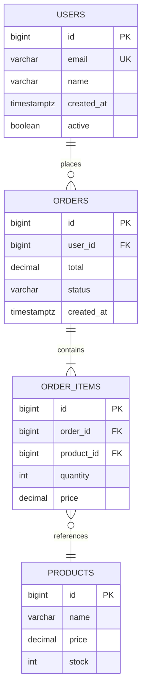

# DB Schema Visualizer Skill

Generate Mermaid ERD diagrams from database schemas defined in code. Supports all major ORMs and raw SQL.

## When to Activate

- After creating or modifying database schemas/migrations
- Before handoff (include ERD in documentation)
- When explaining data model to stakeholders
- When reviewing schema design for normalization issues
- When planning API design based on data model

## Detection: Which ORM/Framework?

| Pattern | Framework | How to extract |
|---------|-----------|----------------|
| `*.prisma` files | Prisma | Read schema.prisma directly |
| `*.schema.ts` with `pgTable` | Drizzle | Parse table definitions |
| `models.Model` | Django | Read models.py |
| `@Entity()` | TypeORM | Parse entity decorators |
| `@Table()` | Sequelize | Parse model definitions |
| `class Base` + `__tablename__` | SQLAlchemy | Read models.py |
| `CREATE TABLE` | Raw SQL | Parse SQL statements |
| `supabase` + migrations | Supabase | Read migrations/*.sql |

## Extraction Commands

### Prisma
```bash
cat prisma/schema.prisma
# Extract: model blocks, fields, relations, enums
```

### Drizzle
```bash
grep -rn "pgTable\|mysqlTable\|sqliteTable" --include="*.ts" --include="*.js" . | head -20
# Extract: table definitions, column types, relations
```

### Django
```bash
grep -rn "class.*models.Model\|class.*Model)" --include="*.py" . | head -20
grep -rn "models\.\(CharField\|IntegerField\|ForeignKey\|ManyToManyField\)" --include="*.py" . | head -40
```

### TypeORM
```bash
grep -rn "@Entity\|@Column\|@ManyToOne\|@OneToMany\|@ManyToMany" --include="*.ts" --include="*.js" . | head -30
```

### Raw SQL
```bash
find . -name "*.sql" -not -path "*/node_modules/*" | head -20
grep -rn "CREATE TABLE\|ALTER TABLE\|FOREIGN KEY" --include="*.sql" . | head -30
```

### Supabase
```bash
cat supabase/migrations/*.sql 2>/dev/null | head -200
# Or read from database directly:
# psql $DATABASE_URL -c "\dt+"
# psql $DATABASE_URL -c "\d+ table_name"
```

## Mermaid ERD Syntax



## Relationship Cardinality

| Symbol | Meaning |
|--------|---------|
| `\|\|--\|{` | One and only one (required) |
| `\|\|--o{` | Zero or one (optional) |
| `\|\|` | One and only one (other side) |
| `o{` | Zero or many |
| `\|{` | One or many |
| `}o--o{` | Many to many |

## Output Format

```markdown
# Database Schema: [Project Name]

## Tables

| Table | Columns | Description |
|-------|---------|-------------|
| users | id, email, name, created_at | User accounts |
| orders | id, user_id, total, status | Customer orders |

## Relationships

```mermaid
erDiagram
    [ERD diagram]
```

## Indexes

| Table | Index | Columns | Type |
|-------|-------|---------|------|
| users | users_email_idx | email | UNIQUE |
| orders | orders_user_id_idx | user_id | btree |

## Constraints

| Table | Constraint | Type | Columns |
|-------|-----------|------|---------|
| orders | orders_user_id_fkey | FK | user_id → users.id |

## Design Notes

- [Normalization level]
- [Soft delete pattern]
- [Multi-tenancy approach]
- [Audit columns pattern]
```

## Schema Design Checklist

When visualizing, also flag:

- [ ] Missing primary keys
- [ ] Missing foreign key indexes
- [ ] VARCHAR vs TEXT (use TEXT unless length limit is enforced)
- [ ] Missing created_at / updated_at on mutable tables
- [ ] No NOT NULL on required fields
- [ ] Missing CHECK constraints for domain rules
- [ ] Sequences / identity columns for auto-increment
- [ ] UUID vs bigint for PKs (recommend bigint for performance)

## When NOT to Use

- For NoSQL databases (MongoDB, DynamoDB) — different visualization
- For simple single-table projects
- When the user wants code, not diagrams

## Pair With

- `database-reviewer` — for query optimization after visualizing
- `flow-visualizer` — for system flow diagrams alongside data model
- `doc-updater` — to include ERD in documentation
