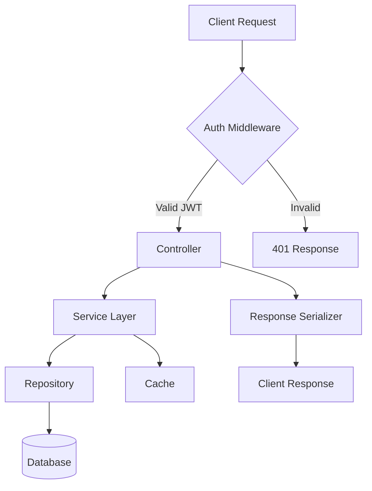
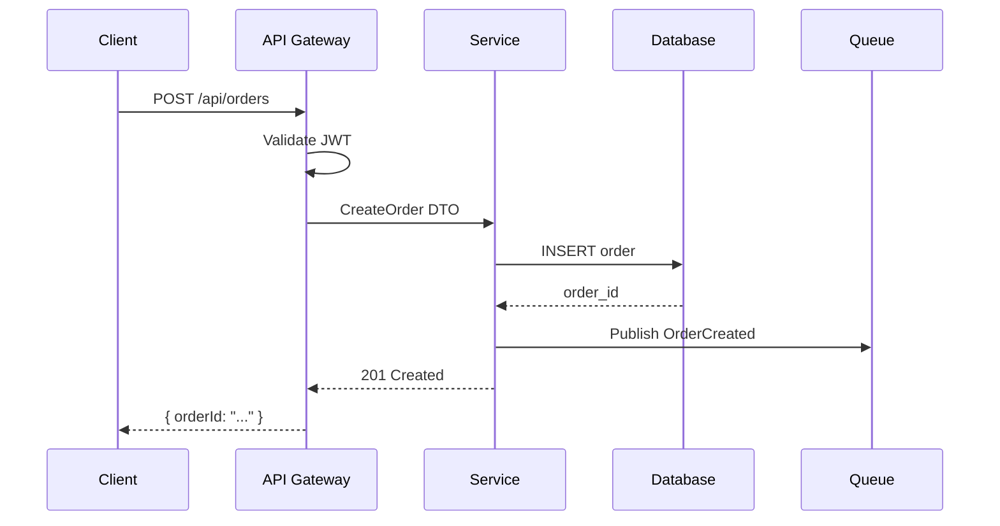
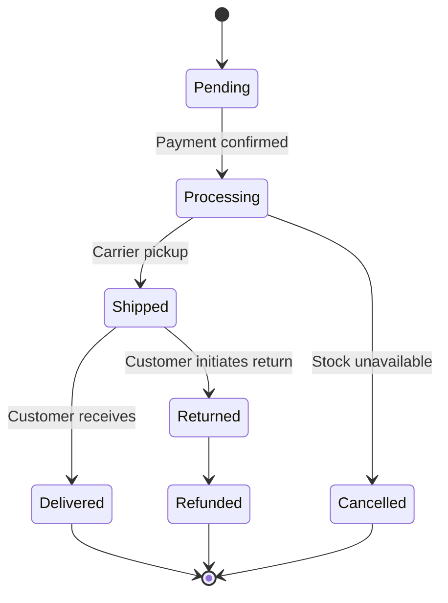
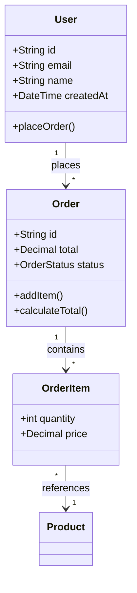

# Flow Visualizer Skill

Generate Mermaid diagrams from code analysis. Produces renderable diagrams for documentation, READMEs, and architecture reviews.

## When to Activate

- User asks for a diagram, flowchart, or visual representation
- After major architectural changes (document the new flow)
- Before handoff/delivery (include diagrams in docs)
- When explaining complex systems to stakeholders
- When code has multiple interacting components

## Diagram Types

### 1. Flowchart (system overview)



### 2. Sequence Diagram (request lifecycle)



### 3. State Diagram (entity lifecycle)



### 4. Class Diagram (data model relationships)



## Extraction Process

### Step 1: Identify Entry Points

```bash
# Find main files
find . -name "main.*" -o -name "index.*" -o -name "app.*" | head -20

# Find routes (Express/Next.js/FastAPI)
grep -rn "router\.\|app\.\(get\|post\|put\|delete\)\|@app\.\|def \|GET\|POST" --include="*.{ts,js,py,go,rs}" . | head -30
```

### Step 2: Trace Call Chain

Follow the execution path:
1. Entry point → Controller/Handler
2. Controller → Service/Business Logic
3. Service → Repository/DAO
4. Repository → Database
5. Service → External APIs
6. Service → Queue/Events

### Step 3: Map Relationships

```bash
# Find imports/dependencies
grep -rn "^import\|^from\|^require\|^use " --include="*.{ts,js,py,go,rs,java,kt}" . | head -40

# Find database models/schemas
find . -name "*.prisma" -o -name "*.schema" -o -name "models.py" -o -name "entities" -type d | head -20
```

### Step 4: Generate Diagram

Produce the appropriate Mermaid diagram based on what you found.

## Output Format

```markdown
# System Architecture: [Project Name]

## Overview

```mermaid
flowchart TD
    [main diagram]
```

## Request Flow

```mermaid
sequenceDiagram
    [sequence diagram]
```

## Data Model

```mermaid
classDiagram
    [class diagram]
```

## Key Components

| Component | File | Purpose |
|-----------|------|---------|
| [name] | [path] | [role] |

## Data Flow Summary

1. [Step 1: What happens]
2. [Step 2: What happens]
...
```

## Language-Specific Patterns

### TypeScript / JavaScript (Express/Next.js/FastAPI)

```bash
# Find routes
grep -rn "router\.\|app\.\(get\|post\|put\|delete\|patch\)" --include="*.ts" --include="*.js" src/

# Find middleware
grep -rn "middleware\|\.use(" --include="*.ts" --include="*.js" src/

# Find controllers
find . -name "*controller*" -o -name "*handler*" -o -name "*route*" | head -20
```

### Python (Django/FastAPI/Flask)

```bash
# Find views/routes
grep -rn "@app\.\|def \|path(" --include="*.py" . | head -30

# Find models
find . -name "models.py" -o -name "schemas.py" | head -10
```

### Go

```bash
# Find routes
grep -rn "HandleFunc\|Handle\|gin\.\|echo\.\|mux\." --include="*.go" . | head -20

# Find structs (data models)
grep -rn "type.*struct" --include="*.go" . | head -20
```

### Rust

```bash
# Find routes (Actix, Axum, Rocket)
grep -rn "#\[get\|#\[post\|#\[put\|#\[delete\|\.route(" --include="*.rs" . | head -20

# Find structs
grep -rn "pub struct\|struct " --include="*.rs" . | head -20
```

## When NOT to Use

- For simple scripts (< 100 lines)
- When the user asks for code, not diagrams
- For single-file projects with no interactions

## Pair With

- `code-explorer` — for deep codebase analysis before diagramming
- `doc-updater` — to include diagrams in documentation
- `db-schema-visualizer` — for database-specific diagrams
