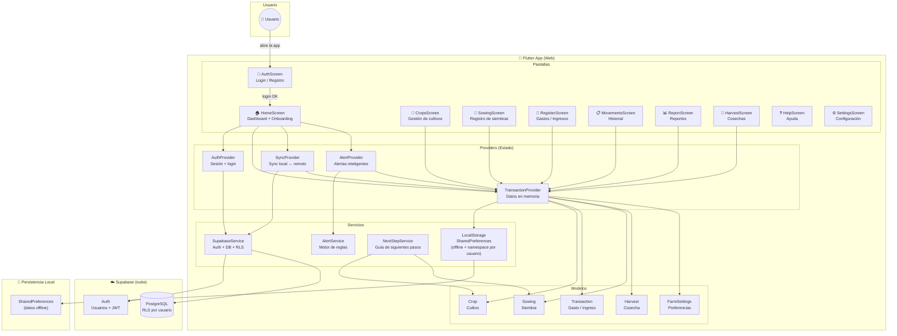
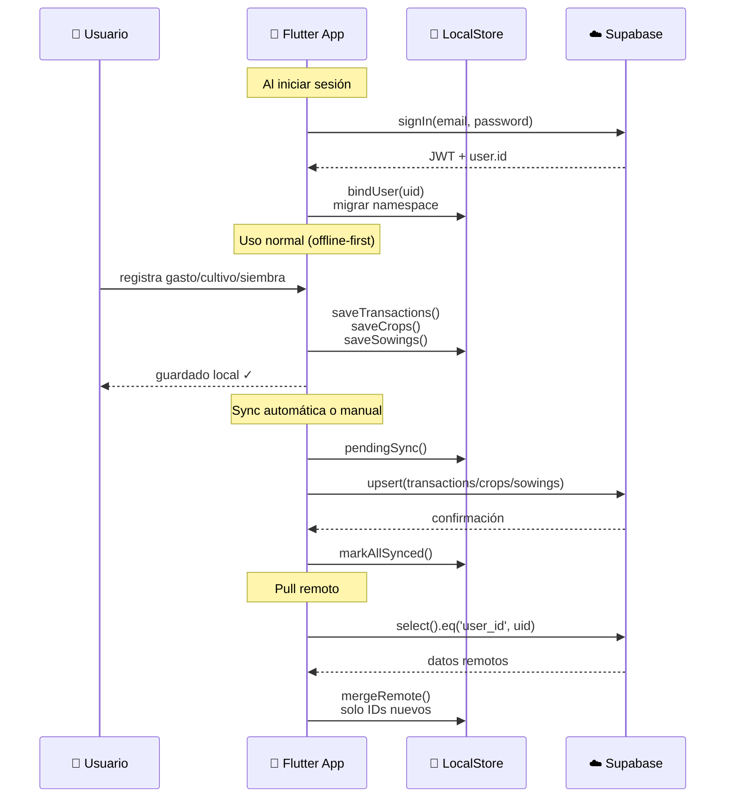
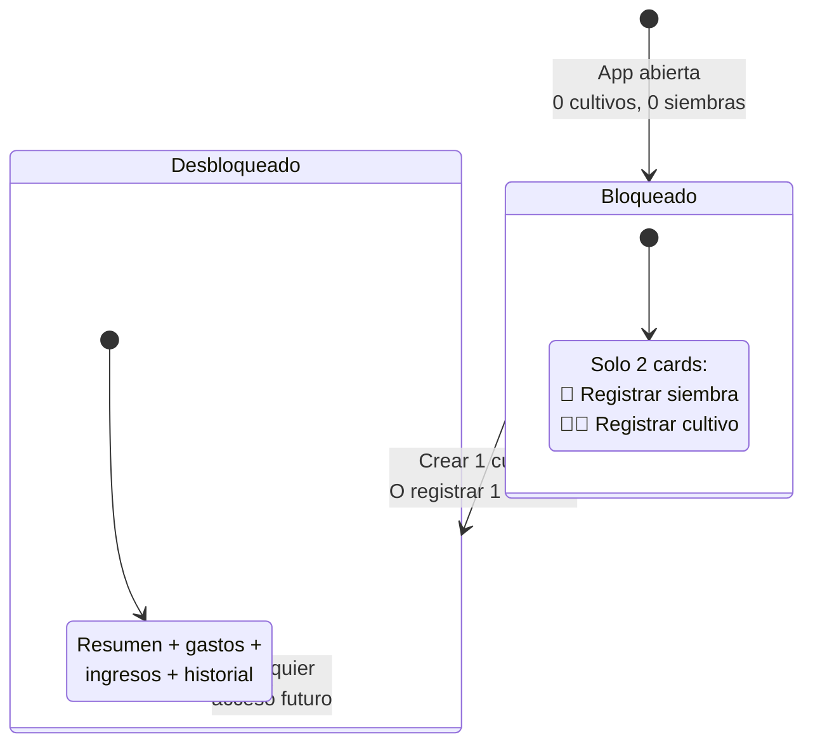
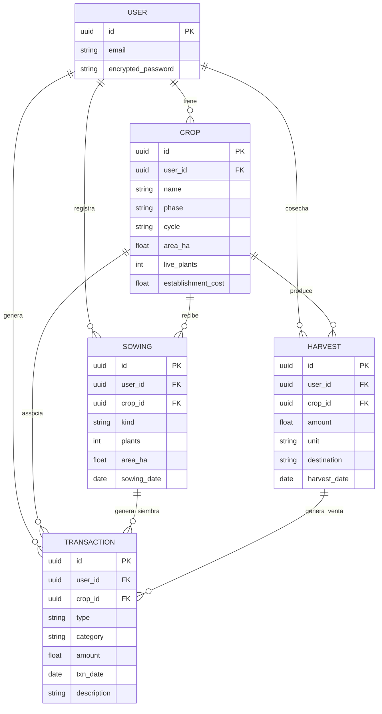

# Arquitectura del Sistema — Mi Cafetal

## Diagrama de Componentes (alto nivel)

## Flujo de Datos (sync)

## Flujo de Onboarding (puerta de entrada)

## Modelo de Datos (relaciones)

---

*Generado: 2026-09-09 | Proyecto: Mi Cafetal | Versión: 1.0*